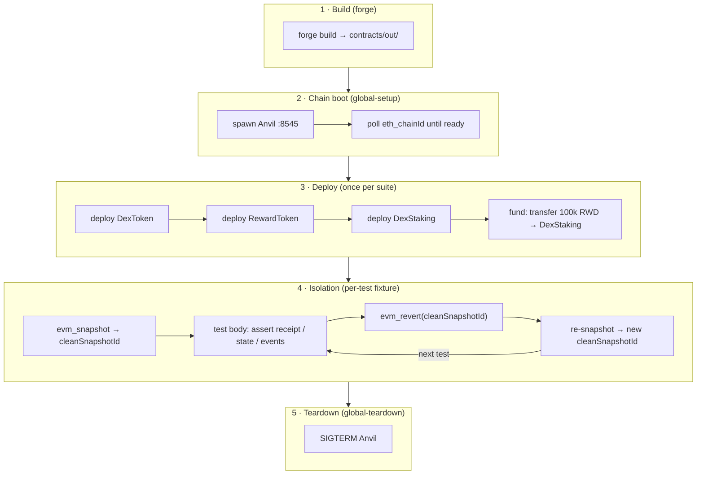

# evm-qa-framework

**A full-stack QA automation framework for EVM/Web3 products, testing a DEX at every layer: contract invariants, transaction lifecycle, JSON-RPC API contract, and on-chain/off-chain SQL reconciliation.**

[](https://github.com/arcamael/evm-qa-framework/actions/workflows/ci.yml)
[](LICENSE)

---

## What this demonstrates

| Layer | Capability |
|---|---|
| **Contract-level** | Foundry unit, fuzz, and invariant tests with a handler-based harness and ghost variables (`contracts/test/`) |
| **Transaction lifecycle** | viem-driven stake/withdraw/reward flows with receipt assertions and event decoding (`tests/staking-lifecycle.spec.ts`) |
| **JSON-RPC API contract** | Positive and negative assertions against `eth_chainId`, `eth_getBalance`, `eth_blockNumber`, `eth_getTransactionReceipt`, `eth_call` (`tests/rpc-api.spec.ts`) |
| **On-chain / off-chain reconciliation** | Testcontainers/Postgres indexer simulation with drift and missing-event detection (`tests/sql-reconciliation.spec.ts`) |
| **Isolation model** | Per-test `evm_snapshot` / `evm_revert` with two RPC calls instead of a full redeploy; per-file Postgres containers for parallel readiness |
| **CI pipeline** | GitHub Actions with ordered steps: forge build → type-check → playwright test (`.github/workflows/ci.yml`) |

The system under test (a minimal DEX: `DexToken`, `RewardToken`, `DexStaking`) is intentionally thin, built from audited OpenZeppelin components. The engineering value is in the test architecture, not the contracts.

---

## Architecture at a glance



See [docs/ARCHITECTURE.md](docs/ARCHITECTURE.md) for the full write-up: SUT design, isolation deep-dive, reconciliation layer, and CI pipeline rationale.

---

## Highlights worth a closer look

- **Handler-based invariants with a ghost variable** — [`contracts/test/handlers/StakingHandler.sol`](contracts/test/handlers/StakingHandler.sol) drives `DexStaking` with bounded random call sequences across three actors. A `ghost_netStaked` variable tracks cumulative stake/withdrawal from the handler's perspective; `invariant_totalStakedMatchesGhost` cross-checks it against on-chain state across tens of thousands of runs.

- **Snapshot/revert isolation** — [`tests/support/snapshot.ts`](tests/support/snapshot.ts) + [`tests/support/fixtures.ts`](tests/support/fixtures.ts) implement a two-call isolation protocol: `evm_revert` rolls back the chain, then `evm_snapshot` immediately mints a fresh ID. Each test starts from an identical post-deploy baseline; contracts are deployed exactly once per suite.

- **Reconciliation with falsifiable negative tests** — [`tests/sql-reconciliation.spec.ts`](tests/sql-reconciliation.spec.ts) includes dedicated drift-detection and missing-event tests that prove the reconciliation check can actually fail. A check that never fails provides no coverage guarantee.

- **Solvency finding documented in ADR-0003** — invariant fuzzing revealed that with a fixed reward fund and unbounded time-warping, ~89% of `claimReward` calls revert. [ADR-0003](docs/adr/0003-reward-solvency-and-claim-reverts.md) documents why this is correct behavior (the contract's solvency guard working as intended), not a defect — and why artificially papering over it would weaken the invariant coverage.

---

## Tech stack

| Tool | Role |
|---|---|
| TypeScript (ESM) | All QA orchestration and test logic |
| Playwright | Test runner, global lifecycle hooks, fixtures |
| viem | EVM client — deployments, transactions, receipts, event decoding |
| Foundry / Anvil | Contract compilation, unit/fuzz/invariant tests, local chain |
| Testcontainers / Postgres | Disposable per-file Postgres instances for reconciliation tests |
| k6 | Load testing (planned) |
| GitHub Actions | CI — build, type-check, test on every push and PR |
| Synpress | Wallet E2E (planned) |

---

## Quickstart

**Prerequisites:**

- Node.js v24 (version pinned in `.nvmrc`; use `nvm use` or `fnm use`)
- pnpm 11.5.2+ — `corepack enable` or `npm install -g pnpm`
- Foundry — `curl -L https://foundry.paradigm.xyz | bash && foundryup`
- Docker — required for the Testcontainers-based reconciliation tests

```sh
pnpm install
pnpm test
```

`pnpm test` runs `forge build` first (via the `pretest` hook in `package.json`), then hands control to Playwright, which spawns Anvil, deploys the SUT, runs all specs, and shuts Anvil down. The HTML report lands in `playwright-report/`.

<!-- TODO: replace the placeholder below with a screenshot of `pnpm test` output -->
<!--  -->

---

## Engineering approach

Decisions are captured as ADRs in [`docs/adr/`](docs/adr/) — the TypeScript-unified stack ([ADR-0001](docs/adr/0001-ts-unified-web3-qa-stack.md)), the serialized-now / per-worker-later isolation model ([ADR-0002](docs/adr/0002-serialized-test-execution.md)), and the solvency finding ([ADR-0003](docs/adr/0003-reward-solvency-and-claim-reverts.md)) are all documented with the alternatives considered and consequences accepted. The `tsc --noEmit` gate and the `forge build` ordering in CI are deliberate: both catch integration breaks (ABI drift, broken imports) before any test process starts. The framework is developed with an AI-assisted-but-reviewed workflow — Claude Code is directed via written briefs and its output is reviewed before merge; [`docs/_architecture-brief.md`](docs/_architecture-brief.md) is an example of that process in practice.

---

## Status and roadmap

**Done (Iterations 0–3):**
- Iteration 0: repo scaffold, Playwright + TypeScript, CI pipeline
- Iteration 1: viem client, Anvil lifecycle, deploy helper, snapshot/revert isolation
- Iteration 2: Foundry unit, fuzz, and invariant suites with handler harness
- Iteration 3: JSON-RPC API contract tests + Testcontainers/Postgres SQL reconciliation

**Planned:**
- Iteration 4: Wallet E2E via Synpress + MetaMask (browser project enabled)
- Iteration 5: k6 load tests against RPC endpoints
- Iteration 6: Observability — structured logging, metric assertions
- Per-worker Anvil parallelism (see [ADR-0002](docs/adr/0002-serialized-test-execution.md) future work)
