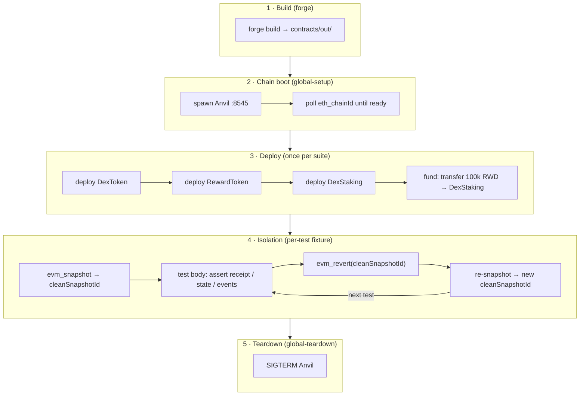

# Architecture

## Overview

This repository is a QA automation framework for a decentralized exchange (DEX) running on an EVM chain. Its purpose is to demonstrate senior SDET practice across the full Web3 testing surface: on-chain transactions, wallet E2E, RPC/API assertions, and CI/CD — all orchestrated in TypeScript.

The exchange is the system under test (SUT). It is deliberately minimal, built from standard, audited components (OpenZeppelin). The engineering value lives in the test architecture, not the contracts. A reader evaluating this project should focus on how tests are structured, isolated, and run — not on what the contracts do.

The stack is fixed by [ADR-0001](adr/0001-ts-unified-web3-qa-stack.md): TypeScript (ESM) throughout, with Playwright as the test runner, viem for chain interaction, and Foundry/Anvil for the local chain and contract compilation.

---

## System-under-test (SUT)

Three contracts live in `contracts/src/`:

**`DexToken`** is a plain OpenZeppelin `ERC20` ("DEX") minted entirely to the deployer at construction. It is the staking token: users transfer DEX into the staking contract to earn rewards.

**`RewardToken`** is structurally identical to `DexToken` — a bare `ERC20` ("RWD"), also minted to the deployer. Its sole role is to be distributed as staking rewards.

**`DexStaking`** connects the two. It implements the Synthetix accumulator pattern: a global `rewardPerTokenStored` counter advances with each block based on a fixed `rewardRate` (set at deploy time), and each staker's share is computed lazily from the delta between the global counter and a per-user checkpoint. The contract exposes `stake`, `withdraw`, and `claimReward`. It holds a `RewardToken` balance (funded at deploy) that it pays out to stakers.

The deploy order is `DexToken → RewardToken → DexStaking(dexToken, rewardToken, rewardRate)`, followed by a transfer of 100,000 RWD from the deployer into the staking contract. That wiring is the entirety of the SUT setup.

---

## Layered architecture



### Local chain — Anvil

Anvil (part of the Foundry toolchain) serves as the local EVM chain. It listens on `http://127.0.0.1:8545` with chain ID `31337` and pre-funds a deterministic set of test accounts with 10,000 ETH each. The framework uses account #0 (`0xf39F...2266`) as the deployer and transaction signer throughout.

### Chain lifecycle — global setup and teardown

`tests/support/anvil.ts` manages the Anvil process. `startAnvil` spawns the process with `stdio: 'ignore'` and then polls `eth_chainId` every 150 ms (up to a 10-second timeout) until the node responds. This readiness poll is important: Anvil starts quickly but not instantaneously, and any RPC call issued before it is listening would fail. `stopAnvil` sends `SIGTERM`.

Playwright's `globalSetup` and `globalTeardown` hooks (`tests/support/global-setup.ts`, `global-teardown.ts`) call `startAnvil` and `stopAnvil` respectively, bracketing the entire test suite.

### Clients — viem public and wallet

`tests/support/client.ts` defines the local Anvil chain for viem using `defineChain` and exports a `publicClient` — a read-only client used for all state assertions and receipt polling. `tests/support/wallet.ts` exports a `walletClient` wired to deployer account #0 via `privateKeyToAccount`. The private key is Anvil's well-known test key and is safe to commit; it carries no real value and is only used on local/CI chains.

### Artifacts — ABI and bytecode loading

`tests/support/artifacts.ts` imports the three Foundry JSON build artifacts from `contracts/out/` using static `import ... with { type: 'json' }` assertions (a Node ESM feature). A small `normalize` function extracts `abi` and `bytecode.object` into the `{ abi, bytecode }` shape that viem's `deployContract` and `getContract` expect. Because the artifacts are imported at module load time, any mismatch between the on-disk JSON and the running test is impossible — both see the same file.

### Deploy helper

`tests/support/deploy.ts` performs the four-step SUT setup described above: deploy DexToken, deploy RewardToken, deploy DexStaking with the first two addresses and a `rewardRate` of 1 RWD/second, then fund the staking contract. It uses `walletClient.deployContract` for each deployment and `publicClient.waitForTransactionReceipt` to block until each transaction is mined before proceeding to the next. It returns the three deployed addresses as a `DeployedDex` object.

### Test isolation — snapshot and fixture

`tests/support/snapshot.ts` wraps two Anvil-specific JSON-RPC methods: `evm_snapshot` returns an opaque snapshot ID representing the full current chain state, and `evm_revert` restores the chain to that state. `tests/support/fixtures.ts` composes these into a Playwright fixture named `dex`.

---

## Test isolation deep-dive

Anvil's `evm_snapshot` / `evm_revert` pair is the mechanism that makes the suite fast and hermetic. After `deployDex()` completes, the fixture takes a snapshot of the freshly-deployed chain and stores the ID in a module-level variable. Every subsequent test receives that clean state: there is no need to redeploy contracts for each test.

There is one critical constraint: **a snapshot ID is consumed on revert**. Calling `evm_revert(id)` restores the chain and invalidates `id`; a second call with the same ID would fail. The fixture handles this by immediately taking a fresh snapshot after every revert:

```typescript
await revertSnapshot(cleanSnapshotId);   // consume id, chain rolls back
cleanSnapshotId = await takeSnapshot();  // mint a new id for the next test
```

This pattern means the cost of isolation is two RPC calls per test (one revert, one snapshot), rather than a full redeploy. On a local chain those calls are sub-millisecond. Each test starts from an identical post-deploy baseline, and the deploy itself happens exactly once.

---

## Off-chain reconciliation layer

Real exchanges run an **indexer**: a service that watches the chain and
writes observed events into a database the application queries, so reads
don't hit the chain directly. The critical QA question is whether that
off-chain store actually agrees with on-chain truth. Iteration 3 builds a
minimal version of this and tests the reconciliation.

### Postgres via Testcontainers

`tests/support/postgres.ts` provisions a disposable `postgres:16-alpine`
container per test file using `@testcontainers/postgresql`, returning a
connected `pg` client. The container is started in `beforeAll` and stopped
in `afterAll`; the container itself is the isolation boundary. This is the
per-worker-isolation model described in ADR-0002 — parallel-ready by
construction, in contrast to the shared Anvil chain.

### Indexer simulation

`tests/support/indexer.ts` defines a `staking_events` table and helpers that
stand in for an indexer. Two schema choices are deliberate:

- **`NUMERIC(78, 0)` for token amounts.** Token values are `uint256`, which
  exceeds a SQL `BIGINT`. `NUMERIC(78, 0)` holds the full 256-bit range
  (2^256 is ~78 digits) with no precision loss — storing on-chain amounts
  off-chain without truncation is a real indexer concern.
- **`tx_hash UNIQUE` with `ON CONFLICT DO NOTHING`.** Indexers can observe
  the same event twice (chain reorgs, service restarts); idempotent inserts
  make re-indexing safe.

### Reconciliation tests

`tests/sql-reconciliation.spec.ts` stakes on-chain, indexes the resulting
`Staked` event into Postgres, and reconciles the two. Beyond the happy path
(off-chain sum equals on-chain `totalStaked`), two negative tests prove the
reconciliation actually detects problems: **drift detection** (a wrong
indexed amount is caught) and **missing-event detection** (an unindexed
stake leaves the off-chain store short). A reconciliation check that cannot
fail is worthless; these prove this one can.

---

## Key design decisions

**TypeScript-unified stack (ADR-0001).** The decision to anchor the entire QA layer in TypeScript was driven by Synpress — the de-facto wallet E2E tool — being Playwright-native. Since wallet testing is a named requirement, Playwright becomes the test runner, and viem (the modern TS EVM client) fits naturally alongside it. A Python-core alternative was considered and rejected; see [ADR-0001](adr/0001-ts-unified-web3-qa-stack.md) for the full comparison. Solidity is retained for contract-level tests via Foundry, but it does not leak into the QA orchestration layer.

**`pretest` forge build.** The `package.json` `pretest` hook runs `cd contracts && forge build` before every `pnpm test` invocation. This guarantees that `contracts/out/` contains fresh artifacts matching the current contract source before any test imports them. Without this, an ABI drift bug — changing a contract but forgetting to rebuild — could cause a silent mismatch.

**`tsc --noEmit` gate.** TypeScript compilation is run as a pre-test gate with `--noEmit` (no JavaScript is emitted; Playwright transpiles TypeScript at runtime with its own internal esbuild-based transform). This catches type errors — including broken imports from `contracts/out/` — before any test process starts.

**Contracts built before type-check in CI.** In the CI pipeline, `forge build` runs as an explicit step before `tsc --noEmit`. The reason is that `artifacts.ts` imports JSON files from `contracts/out/`. If those files do not exist when `tsc` runs, the import fails and the type-check step errors. Building contracts first ensures the JSON is present for TypeScript to resolve.

**Serialized execution (ADR-0002).** Tests run on a single worker (`workers: 1`). Snapshot/revert isolation operates on global chain state, which is only safe when worker access is serialized; see [ADR-0002](adr/0002-serialized-test-execution.md). A per-worker-chain design that restores parallelism is documented there as future work.

**Single browser project.** `playwright.config.ts` defines one project (`chain`) with no browser specified. Current tests are RPC-level and require no browser. A browser project for Synpress wallet E2E is deferred to a later iteration.

---

## CI pipeline

The GitHub Actions workflow (`.github/workflows/ci.yml`) runs on every push to `main` and on all pull requests. The steps are ordered to satisfy dependency constraints:

| Step | Why here |
|---|---|
| Checkout with `submodules: recursive` | `contracts/lib/` holds OpenZeppelin as a git submodule; Forge needs it to compile |
| Install Foundry toolchain | `forge` and `anvil` must exist before any contract or chain step |
| `forge build` (contracts dir) | Produces `contracts/out/` so TypeScript can import ABIs during the type-check step |
| Install pnpm | Package manager needed before Node dependencies |
| Setup Node (from `.nvmrc`) | Pin Node version; enables pnpm cache |
| `pnpm install --frozen-lockfile` | Lockfile enforcement; fails on drift |
| `tsc --noEmit` | Type-check before spending time on browser installation or tests |
| `playwright install --with-deps chromium` | Only chromium; no full browser matrix needed for current tests |
| `pnpm test` | Triggers `pretest` (`forge build`) then `playwright test` |

The ordering of `forge build` before `tsc --noEmit` is deliberate: the contract artifacts must be on disk for TypeScript to resolve the JSON imports in `artifacts.ts`.

---

## How to run

**Prerequisites:**

- Node.js (version pinned in `.nvmrc`)
- pnpm 11.5.2+ (`npm install -g pnpm` or `corepack enable`)
- Foundry (`curl -L https://foundry.paradigm.xyz | bash && foundryup`)

**Run the suite:**

```sh
pnpm install
pnpm test
```

`pnpm test` runs `forge build` first (via the `pretest` hook), then hands control to Playwright, which spawns Anvil, deploys the SUT, runs all specs, and shuts Anvil down. The HTML report is written to `playwright-report/`.
